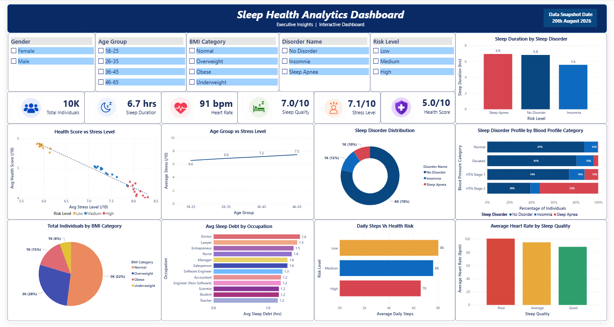

# 🌙 Sleep Health Analytics Dashboard

**Executive Insights | Interactive Business Intelligence Dashboard**



---

## 📌 Overview

The **Sleep Health Analytics Dashboard** is an interactive Business Intelligence report built to analyze sleep health trends, lifestyle factors, and health risk indicators across **10,000 individuals**. It combines executive-style KPI summaries with dynamic visualizations and cross-filtering slicers to support fast, data-driven decision-making.

The dashboard presents a centralized view of sleep duration, stress levels, heart rate, BMI distribution, sleep disorders, blood pressure profile, and occupational sleep patterns — all within a clean, single-screen executive layout.

**Data Snapshot Date:** 25 August 2026

---

## 📊 Key Metrics (KPI Summary)

| Metric | Value | Description |
|---|---|---|
| **Total Individuals** | 10K | Total number of records analyzed |
| **Avg Sleep Duration** | 6.7 hrs | Mean sleep duration across all individuals |
| **Avg Heart Rate** | 91 bpm | Average resting heart rate |
| **Avg Sleep Quality** | 7.0 / 10 | Overall sleep quality score |
| **Avg Stress Level** | 7.1 / 10 | Mean stress level across the dataset |
| **Avg Health Score** | 5.0 / 10 | Composite health score across individuals |

---

## 🎛️ Interactive Filters

The dashboard supports dynamic, cross-visual filtering through the following slicers:

- **Gender** — Female, Male
- **Age Group** — 18–25, 26–35, 36–45, 46–65
- **BMI Category** — Normal, Overweight, Obese, Underweight
- **Disorder Name** — No Disorder, Insomnia, Sleep Apnea
- **Risk Level** — Low, Medium, High

All visualizations update dynamically based on the selected filter combination.

---

## 📈 Dashboard Visualizations

| Chart | Insight Delivered |
|---|---|
| **Sleep Duration by Sleep Disorder** | Compares average sleep duration across No Disorder, Insomnia, and Sleep Apnea groups |
| **Health Score vs Stress Level** | Scatter plot revealing a strong inverse relationship between stress and overall health score |
| **Age Group vs Stress Level** | Trend line showing how average stress increases across age brackets |
| **Sleep Disorder Distribution** | Donut chart showing the proportional split between No Disorder, Insomnia, and Sleep Apnea |
| **Sleep Disorder Profile by Blood Pressure Category** | Stacked bar comparing sleep disorder prevalence across Normal, Elevated, HTN Stage 1, and HTN Stage 2 blood pressure groups |
| **Total Individuals by BMI Category** | Pie chart of population distribution across Normal, Overweight, Obese, and Underweight |
| **Avg Sleep Debt by Occupation** | Bar chart ranking occupations by average accumulated sleep debt |
| **Daily Steps vs Health Risk** | Compares average daily step count across Low, Medium, and High health risk levels |
| **Average Heart Rate by Sleep Quality** | Compares average resting heart rate across Poor, Average, and Good sleep quality groups |

---

## 🧠 Business Insights

- Individuals with **Sleep Apnea** report the lowest average sleep duration (**5.6 hrs**) compared to No Disorder (**6.8 hrs**) and Insomnia (**6.9 hrs**)
- **Stress and health score are strongly inversely correlated** — as stress rises, health score consistently declines
- **78%** of individuals report no sleep disorder, while Insomnia (**12%**) and Sleep Apnea (**10%**) account for the remainder
- **HTN Stage 2** individuals show a markedly higher proportion of sleep disorders compared to those with Normal blood pressure
- **Doctors and Lawyers** carry the highest average sleep debt among all tracked occupations
- Individuals with **higher daily step counts** trend toward **lower health risk levels**
- **Poor sleep quality is associated with higher average heart rate**, reinforcing the link between sleep and cardiovascular indicators

---

## 🧩 Data Model

The dashboard is powered by a **star schema** data model, separating a central fact table from supporting dimension tables for scalable, efficient analysis.


**Fact Table**
- `Fact_SleepHealth` — Age, Daily Steps, Diastolic BP, Health Score, Has Sleep Disorder, and foreign keys to all dimensions

**Dimension Tables**
- `Dim_AgeGroup`
- `Dim_Gender`
- `Dim_BMI`
- `Dim_BPCategory`
- `Dim_SleepDisorder`
- `Dim_SleepQuality`
- `Dim_HealthRiskLevel`
- `Dim_Occupation`

This structure follows standard dimensional modeling best practices, enabling efficient filtering, aggregation, and scalability as the dataset grows.

---

## 🛠️ Technologies Used

- **Power BI** — dashboard development and visualization
- **DAX** — calculated measures and KPIs
- **Power Query** — data transformation and cleaning
- **Star Schema Data Modeling** — fact/dimension table design
- **Interactive Slicers & Cross-Filtering**

---

## 🎨 Design Principles

- Executive, single-screen layout with a clear top-down information hierarchy (filters → KPIs → relationships → granular breakdowns)
- Unified color encoding for repeated categories (e.g., Sleep Disorder types use identical colors across every chart)
- Colorblind-accessible palette (Amber / Blue / Red used in place of Red/Green/Blue for risk levels)
- Zero-based, properly scaled axes to avoid visually exaggerated trends
- Consistent number formatting (whole-number percentages, K-abbreviated counts)
- Minimalistic navy, red, blue, and amber color palette for a clean, professional finish

---

## 📁 Folder Structure

```
dashboard/
│
├── Sleep_Health_Analytics_Dataset.xlsx
│
├── Sleep_Health_Analytics_Dashboard.pbix
│
├── README.md
│
├── DAX_Measures.md
│
├── screenshots/
    ├── sleep-health-analytics-dashboard.png
    └── sleep-health-data-model.png


```

---

## 📂 Dataset

> **Note:** This project uses a **synthetic dataset** (n = 10,000 records) created for portfolio and analytical practice purposes. It does not represent real individuals or verified clinical data.

- **Source:** Synthetically modified Sleep Health Analytics Dataset
- **Records:** 10,000
- **Snapshot Date:** 18th August 2026

---

## 🚀 Future Enhancements

- Drill-through analysis for individual-level records
- Time-series trend analysis across multiple snapshot dates
- Predictive analytics integration (e.g., health risk prediction model)
- Automated report export and scheduled refresh
- Real-time data refresh via connected data source

---

## 📬 Contact

**Rushikesh Ravindra Khamgaonkar**
📧 [rushikeshkhamgaonkar9869@gmail.com](mailto:rushikeshkhamgaonkar9869@gmail.com) | 🔗 [LinkedIn](https://www.linkedin.com/in/rushikesh-khamgaonkar-588b77227/)

---

*⭐ If you found this project useful or insightful, consider starring the repository.*
